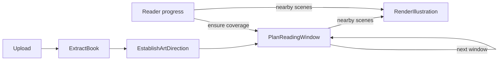

# Reading and illustration workflow

## Durable graph



`domain/book-workflow.ts` owns scheduling and stage status. `data/book-pipeline.ts` dispatches every job kind to a dedicated service in `data/steps/`. The dispatch table is exhaustive at compile time. Each step commits its result and follow-up jobs in one lease-guarded transaction. PostgreSQL persists the graph between worker runs; no in-memory conversation must survive a restart.

PDF display starts immediately. Extraction reads the PDF into numbered pages. Art direction then uses the title and up to twelve opening pages, limited to 24,000 characters, to identify the work when supported and choose its setting, medium, palette and composition. Unknown title/author remain null. The style describes the story's setting, which can differ from its publication period, and is saved once per book.

The initial planning target is fifty pages. Consecutive planning windows contain at most eight whole PDF pages and 24,000 text characters. A page too dense for that budget fails visibly; planning never silently truncates a page. One planning lane advances windows in order while two rendering lanes generate nearby images independently.

## Model contracts

The exact Effect schemas and input types live in `packages/contracts/src/planning.ts`.

Art direction returns:

```ts
{
  title: string | null,
  author: string | null,
  setting: string,
  style: string
}
```

Planning receives `start`, exclusive `end`, total `pageCount`, numbered `pages`, saved `direction`, the character appearances known before this window, the preceding `summary`, an optional `activeScene`, and optional validation `feedback` from the previous attempt. Its output is:

```ts
{
  scenes: [{
    prompt: string,
    sourcePages: number[],
    untilPage: number,
    characters: string[]
  }],
  carryUntilPage: number | null,
  characterUpdates: [{
    name: string,
    aliases: string[],
    appearance: string,
    design: string,
    clothing: string,
    knownAfterPage: number
  }],
  summary: string
}
```

`sourcePages` references physical PDF page numbers supplied in this window. `untilPage` is exclusive. The application reveals a scene on `max(sourcePages) + 1`, assigns its persistent ID, inserts blank intervals, and freezes the full image prompt with art direction and the appropriate character snapshots. The model does not allocate IDs or construct an exhaustive timeline. Zero scenes and zero character updates are valid.

`PlanningWindow.open` owns the input budget. `PlanningWindow.compile` checks source membership, chronology, non-overlap and character availability, then constructs the saved plan. Effect Schema decodes the external response before these relational rules run. Structural validation cannot prove that prose contains no hallucinations or spoilers; review generated scenes against the book when assessing model quality.

## Character memory

`CharacterMemory` owns identity matching and append-only appearance history. The model uses names and known aliases; the application assigns stable character IDs. Updates are complete snapshots of appearance, deliberate design choices for unspecified features, and temporary clothing, dated to the page establishing them. Existing snapshots need not be copied into every response.

A later coat, injury, disguise or age does not replace earlier history. Each scene resolves characters at its latest source page and saves those snapshots inside its immutable render request. Subsequent planning and rendering cannot silently change an earlier prompt. Conflicting identities or references unavailable at that page fail with `InvalidPlan`; the next durable attempt receives feedback to correct the proposal.

Appearance consistency is driven by text prompts. It does not guarantee identical faces across independently generated images. Reference-image conditioning would be a separate rendering capability.

## Display timing

Pages are one-based and intervals are `[start, end)`. Text on page 3 can support an image on page 4 at the earliest. A page viewport cannot establish which sentence has been read.

A scene supported by the final page of a window may be saved for the next window. A scene cannot reveal beyond the final book page. The next plan explicitly carries it with `carryUntilPage`. Render jobs are created for spans intersecting the current page through twelve pages ahead. Saved artifacts remain hidden outside their spans; returning to earlier pages reuses them.

Jumping ahead raises the target, and planning continues sequentially with saved memory. Already queued image jobs may finish after a jump. A missing image never blocks reading.

## Failure and recovery

The inspector exposes `extract`, `art-direction`, `plan` and `render` with waiting, queued, running, retrying, failed or completed status. The reader reports art-direction preparation, automatic retries and actionable failures.

Invalid proposals, transient provider failures, database/storage errors and claim conflicts use the persistent retry policy: three total attempts with two- and four-second delays. Invalid documents and permanent provider failures stop immediately. The provider adds no nested retry loop. Retry feedback is persisted alongside the job. An owner can explicitly reset failed jobs after correcting the cause.

Each attempt has a fencing token and five-minute lease. Successful steps can be replayed without regenerating committed results. Render uploads use bounded compensation after a confirmed failed commit. Cancellation during a commit or a lost commit response preserves the object and logs its key, because the database may already reference it. A crash after a paid provider response but before its result is saved can still incur another provider call.

Every step, domain Effect operation and AI request is traced. Follow-up jobs retain the current trace context and retries restore it, connecting the HTTP request to later worker activity. See [observability](observability.md).
